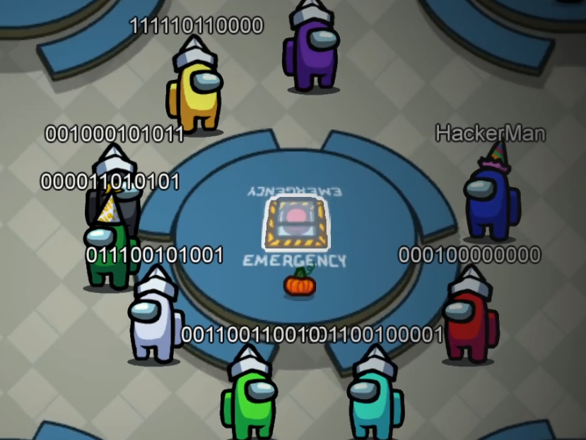

# Among Us Stuff

Dumping everything Among Us related that I've been working on

## Protocol - [protocol.md](/protocol.md)

A dissection of the Among Us protocol

## Reversing Guide - [reversing.md](/reversing.md)

Various ways to approach reversing Among Us

## Client - [`/client`](/client)

A working client written in rust. Can join games, chat, teleport players into vents etc. Buggy and unfinished. Ignore the gui

## Dissector - [`/dissector`](/dissector)

Abandoned. A wireshark plugin in pure rust for dissecting among us packets. Left in because I don't think there are any other examples of pure rust wireshark plugins online

[`epan-sys`](/epan-sys) - Bindgen for the wireshark Enhanced Protocol ANalyzer library

## Related links

* Overview of an older version of the RUDP protocol used <https://www.darkriftnetworking.com/Hazel/Docs/html/490c9f89-38c8-4ccf-8af1-683ba7fb0888.htm>

* Impostor - An open source reimplementation of the Among Us Server  <https://github.com/AeonLucid/Impostor>

* `playerPrefs` editor <https://github.com/Koupah/Among-Us-Editor>

* DEF CON Safe Mode - Jack Baker - Finding and Exploiting Bugs in Multiplayer Game Engines 41:38 <https://www.youtube.com/watch?v=4weoWSzuCxs>
