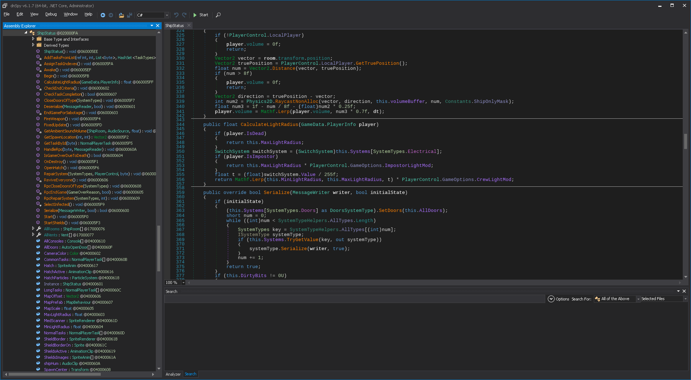
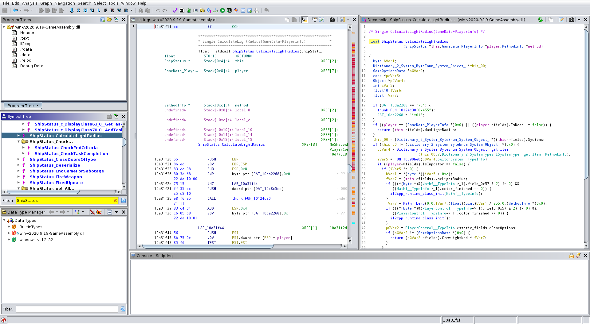
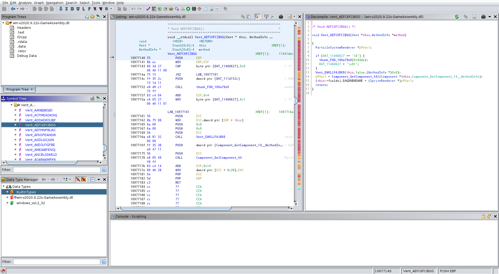
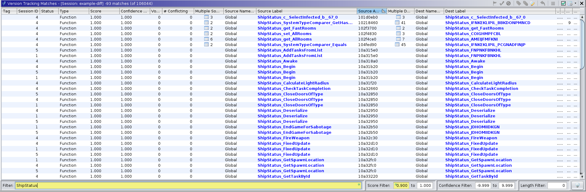
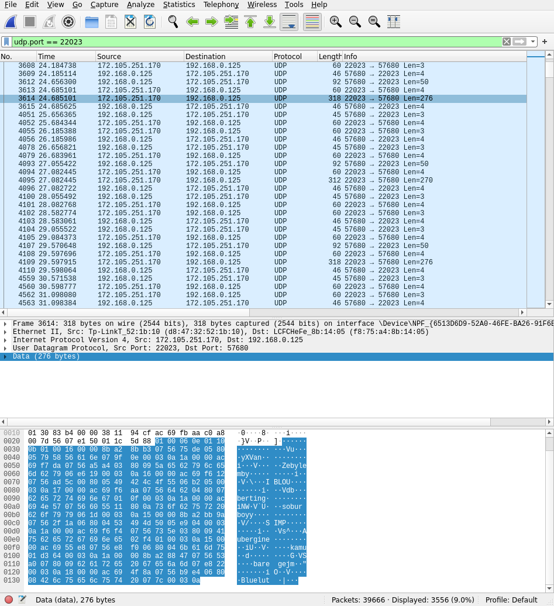
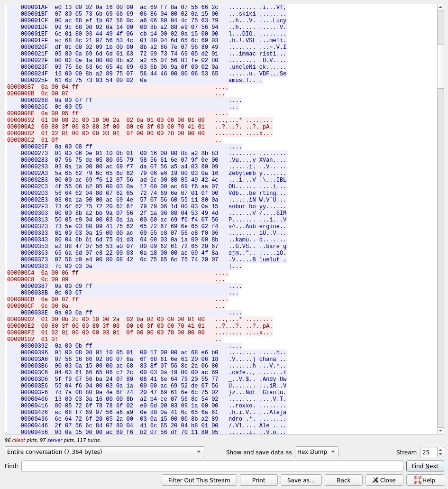
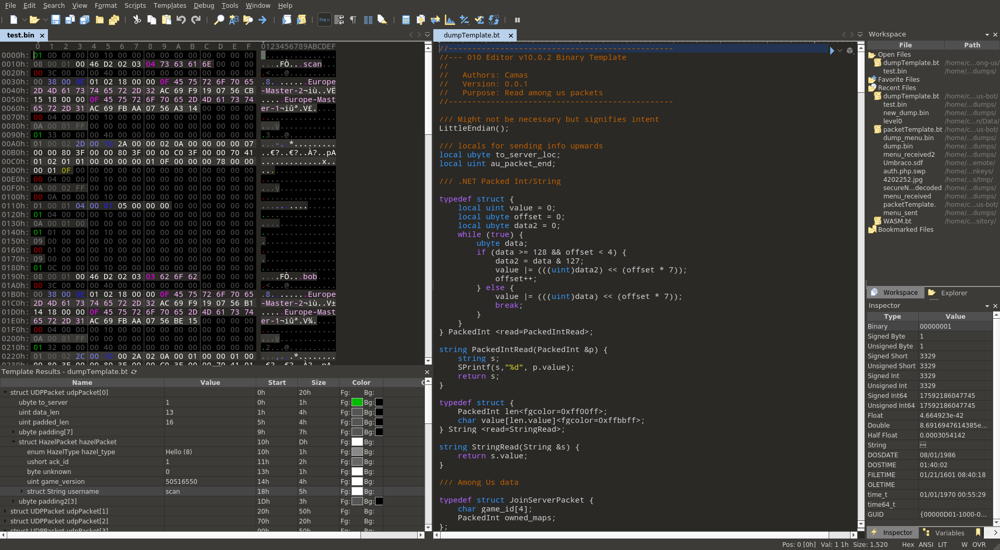

# Reversing

## Decompiling

Among Us is a Unity game, so fairly easy to decompile. Some changes have been made over time that have made this more difficult, but nothing drastic. The fact that these changes were made incrementally makes it easier too, as now we can compare between versions to infer missing information

### Until ~v2019.4.24

Older versions of the game didn't use il2cpp or any obfuscation so code is compiled as .NET IL in `Assembly-CSharp.dll`.

Use [dnSpy](https://github.com/0xd4d/dnSpy) to get close to perfect code decompilation



### Between ~v2019.4.24 to v2020.9.19

These versions of the game use il2cpp to first turn IL into C++ before compiling. See: <https://docs.unity3d.com/Manual/IL2CPP-HowItWorks.html>

Can still use tools like [Il2CppInspector](https://github.com/djkaty/Il2CppInspector#adding-metadata-to-your-ghidra-workflow) to get symbol and function names, then use [Ghidra](https://ghidra-sre.org/) (Free) or IDA to analyze/decompile



Note when using Ghidra: Version 9.2 (yet to be released) is substantially faster than 9.1.2. For me it was quicker to compile the latest version of Ghidra myself and decompile two versions of Among Us than it was to use 9.1.2 to decompile them both. Alternatively use a custom pre-compiled version like [garyttierney/ghidra-batteries-included](https://github.com/garyttierney/ghidra-batteries-included)

### v2020.9.22 onwards

A cheap obfuscator is now being used which means that a lot of the names Il2CppInspector helps you find are now things like `PMFKLCCNLIE_MKPEONCAMAF` and `Vent_AEFCKFCIBGG`



Since there usually isn't a lot of change between versions you can use things like Ghidra's Version Tracking or bindiff to map known names from previous versions onto the obfuscated new version.



## Packet Inspection

Among Us data is sent over UDP without any encryption or obfuscation so is fairly simple to capture and read

### Wireshark

You can use Wireshark with the filter set to `udp.port == 22023` to see game packets (`22024` for announcement data) and then `Right Click -> Follow -> UDP Stream` to see the entire conversation in various formats

|Wireshark|Stream|
|:-:|:-:|
|

### 010 Editor Templates

010 editor templates make it easy to quickly define structures and see them in binary data. Packets aren't a single binary blob so first I get relevant data from a saved capture then use `dump-tranformer` to get a parsable file.

```cmd
tshark -r test.pcapng -Y 'udp.port == 22023' -Tfields -e 'udp.srcport' -e 'data.data' > test.txt
cargo run --bin dump-transformer -- test.txt test.bin
```



Packets padded so they all start at 0. Green above means outbound, red inboud. Unparsed data colored yellow so it stands out
